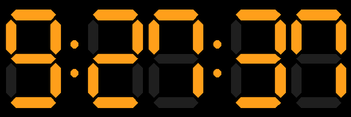
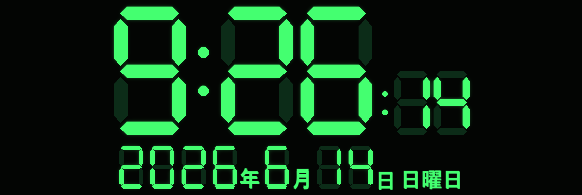
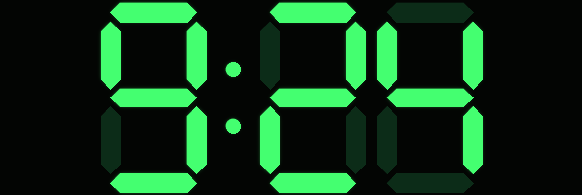
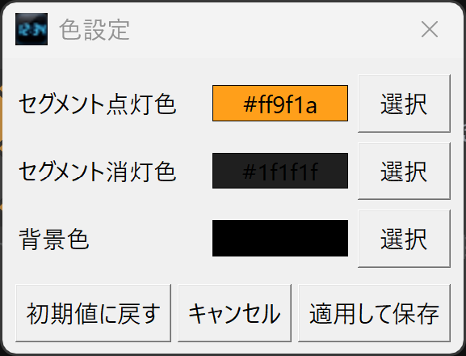

# 7セグメント デジタル時計

Tkinterで作成した、7セグメント風のデジタル時計アプリです。
Windowsデスクトップ上で、リサイズ可能なデジタル時計として使用できます。

## スクリーンショット

| 通常表示 | 日付表示 |
| --- | --- |
|  |  |

| 時計のみ表示 | 色設定 |
| --- | --- |
|  |  |

## ダウンロード方法

最新版は GitHub Releases からダウンロードできます。

1. 以下のリンクから最新リリースページを開きます。
   https://github.com/ShinonomeSyusui/PythonDigitalClockApply/releases/latest

2. ページ下部の **Assets** から、以下のZIPファイルをダウンロードしてください。
   `SevenSegmentClock-v1.4.4.zip`

3. ダウンロードしたZIPファイルを展開します。

4. 展開したフォルダ内の `SevenSegmentClock.exe` を実行してください。

※ `Source code (zip)` や `Source code (tar.gz)` は開発者向けのソースコードです。
アプリを使うだけの場合は、`SevenSegmentClock-v1.4.4.zip` をダウンロードしてください。

ローカルでリリースZIPを作成する場合は、次を実行します。

```bat
build_release.bat
```

成功すると、次のファイルが作成されます。

```text
release\SevenSegmentClock-v1.4.4.zip
```

## 開発環境

- Windows
- Python 3.10以上
- Tkinter（Python標準ライブラリ）
- Pillow（高画質描画に使用）
- PyInstaller（exe化に使用）

## 起動方法

```bat
python main.py
```

互換用として、次のコマンドでも起動できます。

```bat
python sevenSegmentClock.py
```

## 使い方

- ウィンドウサイズを変更すると、時計表示も自動で拡大・縮小します。
- ウィンドウサイズと位置は、次回起動時にも復元されます。
- 時刻の「時」は先頭ゼロなしで表示します。
  - 例: `1:05:09`, `9:30`, `13:05:09`
- 分と秒は2桁で表示します。

## ショートカットキー

- `F11`: 時計のみ表示のON/OFF
- `T`: 最前面表示のON/OFF
- `S`: 秒表示のON/OFF

## 色変更方法

1. メニューバーの「設定」を開きます。
2. 「色設定...」を選びます。
3. 次の色を変更できます。
   - セグメント点灯色
   - セグメント消灯色
   - 背景色
4. 色を選ぶと、時計に即時プレビューされます。
5. 「適用して保存」を押すと、次回起動時にも反映されます。

「キャンセル」を押すと、色設定画面を開く前の色へ戻ります。

## 表示オプション

メニューバーの「表示」から変更できます。

- レイアウトプリセット（標準 / コンパクト / 日付つき / 時計のみ表示向け）
- 最前面表示
- 秒を表示
- 秒サイズ（標準 / 小さめ）
- 24時間表示（OFFにすると12時間表示）
- 日付表示（非表示 / 月日 / 月日＋曜日 / 年月日 / 年月日＋曜日）
- 曜日色（土曜を青、日曜を赤）
- 透明度（50〜100%、5%刻み）
- 背景を透明にする
- 高画質描画
- LED発光効果
- 時計のみ表示

秒サイズを「小さめ」にすると、秒だけを約半分の大きさで表示し、時分の下側に揃えます。
日付表示をONにすると、時計の下側に日付を表示します。日付の数字は7セグメント風、`年`、`月`、`日`、曜日はゴシック体で、数字の下側に揃えて表示します。
曜日色をONにすると、月日＋曜日または年月日＋曜日表示のときに土曜日は青、日曜日は赤で表示します。
12時間表示では、時計の右下に `AM` / `PM` を小さく表示します。
高画質描画をONにすると、Pillowを使って高解像度の画像として時計を描画します。セグメントの輪郭がなめらかになり、LED発光効果をONにすると点灯部分に淡い光が加わります。Pillowが使えない環境では、従来のCanvas描画へ自動で戻ります。
透明度設定では、スライダーで50〜100%の範囲を5%刻みで調整できます。スライダー操作中は即時プレビューされ、キャンセルすると元の透明度へ戻ります。
「背景を透明にする」をONにすると、数字の点灯部分はそのまま表示し、背景とセグメント消灯部分を透明化します。時計のみ表示モード中でも、透明部分を右クリックして操作メニューを表示したり、左ドラッグで移動したりできます。

## レイアウトプリセット

「表示」→「レイアウトプリセット」から、よく使う表示状態をまとめて切り替えられます。

- 標準: 秒あり、秒サイズ標準、日付なし
- コンパクト: 秒なし、日付なし
- 日付つき: 秒小さめ、年月日表示
- 時計のみ表示向け: 秒小さめ、時計のみ表示、最前面表示、透明度90%

各表示項目を手動で変更すると、プリセットは「カスタム（手動設定）」扱いになります。

## テーマ

メニューバーの「設定」から、配色テーマを選べます。

- カスタム（現在の色）
- オレンジLED
- ブルーLED
- グリーン端末
- レッドLED

テーマを選ぶと、点灯色、消灯色、背景色がまとめて変更されます。
個別に色を選び直すと、テーマはカスタム扱いになります。テーマを切り替えた後にカスタムへ戻すと、最後に設定したカスタム色へ戻ります。

「昼夜テーマ自動切替」をONにすると、6:00〜17:59はオレンジLED、18:00〜5:59はブルーLEDへ自動で切り替わります。
手動でテーマや色を選ぶと、自動切替はOFFになります。

## 自作テーマ

「設定」→「自作テーマ」から、現在の色を自作テーマ1〜3へ保存できます。
保存した自作テーマは、同じメニューから読み込めます。

通常のテーマを試したあとでも、自分で作った配色をすぐ戻せます。

## 設定のバックアップ

「設定」メニューから、設定のエクスポートとインポートができます。

- 設定をエクスポート: 現在の設定をJSONファイルとして保存
- 設定をインポート: 保存しておいたJSONファイルから設定を復元

自作テーマ、表示設定、ウィンドウサイズなどもまとめて保存できます。

## 時計のみ表示

「表示」メニューの「時計のみ表示」をONにすると、上部のタイトルバーとメニューバーを隠し、時計だけを表示します。
時計のみ表示モード中にタスクバーアイコンが表示されない場合でも、タスクトレイメニューから通常表示へ戻したり、アプリを終了したりできます。


時計のみ表示中の操作は次のとおりです。

- 左ドラッグ: ウィンドウ移動
- 右クリック: 操作メニューを表示
- Escキー: 通常表示へ戻る

右クリックメニューからは、通常表示に戻す、色設定、最前面表示、秒表示、24時間表示、終了を操作できます。

## タスクトレイ常駐

  * トレイメニューから表示・非表示を操作
  * トレイメニューから時計のみ表示を切り替え
  * トレイメニューから終了


## ウィンドウ位置と自動起動

「設定」→「画面中央へ戻す」を選ぶと、ウィンドウを現在の画面中央へ戻します。
前回保存した位置が画面外にある場合は、次回起動時に自動で画面内へ戻します。

「設定」→「設定フォルダを開く」を選ぶと、`settings.json` が保存されるフォルダを開けます。

「設定」→「Windows起動時に自動起動」をONにすると、Windowsのスタートアップフォルダへ `SevenSegmentClock.cmd` を作成します。
OFFにすると、このファイルを削除します。

## バージョン情報

「ヘルプ」→「このアプリについて」から、アプリ名、バージョン、設定ファイルの場所、ショートカットキーを確認できます。

## 初期化

「設定」→「初期化」から、戻したい設定だけを選べます。

- 色だけ初期化
- 表示設定だけ初期化
- ウィンドウ位置だけ初期化
- すべて初期化

## 設定ファイルについて

設定はアプリと同じフォルダの `settings.json` に保存されます。

保存される内容は次のとおりです。

- セグメント点灯色
- セグメント消灯色
- 背景色
- 最前面表示
- 秒表示
- 秒サイズ
- 24時間表示
- 時計のみ表示
- テーマ
- 自作テーマ1〜3
- 透明度
- 日付表示パターン
- 曜日色
- 高画質描画
- LED発光効果
- レイアウトプリセット
- Windows起動時に自動起動
- 昼夜テーマ自動切替
- ウィンドウサイズ
- ウィンドウ位置

`settings.json` が存在しない場合は、初期値で起動します。
ファイルが壊れている場合も、アプリは落ちずに初期値で起動します。

exe化後は、`SevenSegmentClock.exe` と同じフォルダに `settings.json` が作成されます。
書き込み権限のない場所で実行すると、設定保存に失敗する場合があります。

## ビルド方法

Windowsで次を実行してください。

```bat
build.bat
```

`build.bat` は、ビルド前に `tools\create_icon.py` を実行して `assets\app_icon.ico` を作成します。
アイコン画像は `assets\app_icon.png` を元画像として使います。
`tools\create_icon.py` は画像を描き直さず、`assets\app_icon.png` をICOコンテナへ格納するためのスクリプトです。

成功すると、次のファイルが作成されます。

```text
dist\SevenSegmentClock.exe
```

配布用ZIPまでまとめて作成する場合は、次を実行してください。

```bat
build_release.bat
```

ZIPには、exe、README、LICENSE、CHANGELOGが含まれます。
`settings.json` はユーザーごとの設定ファイルのため、配布ZIPには含めません。

## クレジット

本アプリは、だえうホームページ様の記事「【Python/tkinter】デジタル時計の作り方（７セグ表示版）」で紹介されている7セグメント風デジタル時計のサンプルコードを参考・出発点として作成しました。

元記事:
https://daeudaeu.com/tkinter-digital-clock/

元コードをもとに、以下の改修・拡張を ShinonomeSyusui が行いました。

- デスクトップアプリとしての構成整理
- ウィンドウサイズ変更への対応
- セグメント色変更UIの追加
- 設定保存機能の追加
- 日付表示機能の追加
- 透明度設定の追加
- 高画質描画対応
- LED発光効果の追加
- Windows向けパッケージ化
- GitHub Releaseでの配布整備

👉 最新版のダウンロードはこちら  
https://github.com/ShinonomeSyusui/PythonDigitalClockApply/releases/latest

## ライセンス

このプロジェクトは MIT License で公開します。
詳細は [LICENSE](LICENSE) を参照してください。

## ファイル構成

```text
main.py                アプリ起動用
clock_app.py           Tkinterアプリ本体
clock_view.py          7セグメント時計の描画処理
settings.py            設定の保存・読み込み
tools/create_icon.py   アプリアイコン生成
docs/screenshots/      GitHub README用スクリーンショット
assets/app_icon.png    アプリアイコン元画像
assets/app_icon.ico    生成されるアプリアイコン
sevenSegmentClock.py   互換用の起動ファイル
requirements.txt       ビルド用依存関係
build.bat              Windows向けビルドスクリプト
build_release.bat      配布用ZIP作成スクリプト
CHANGELOG.md           変更履歴
LICENSE                ライセンス
README.md              この説明書
```
